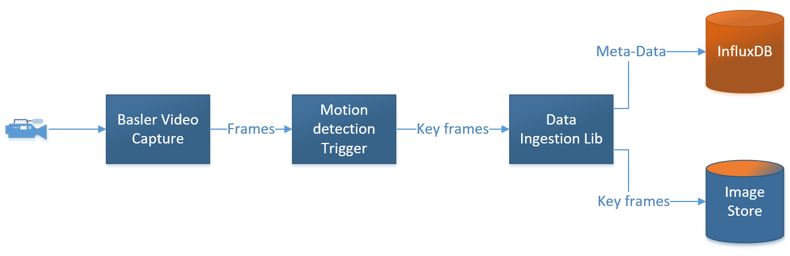
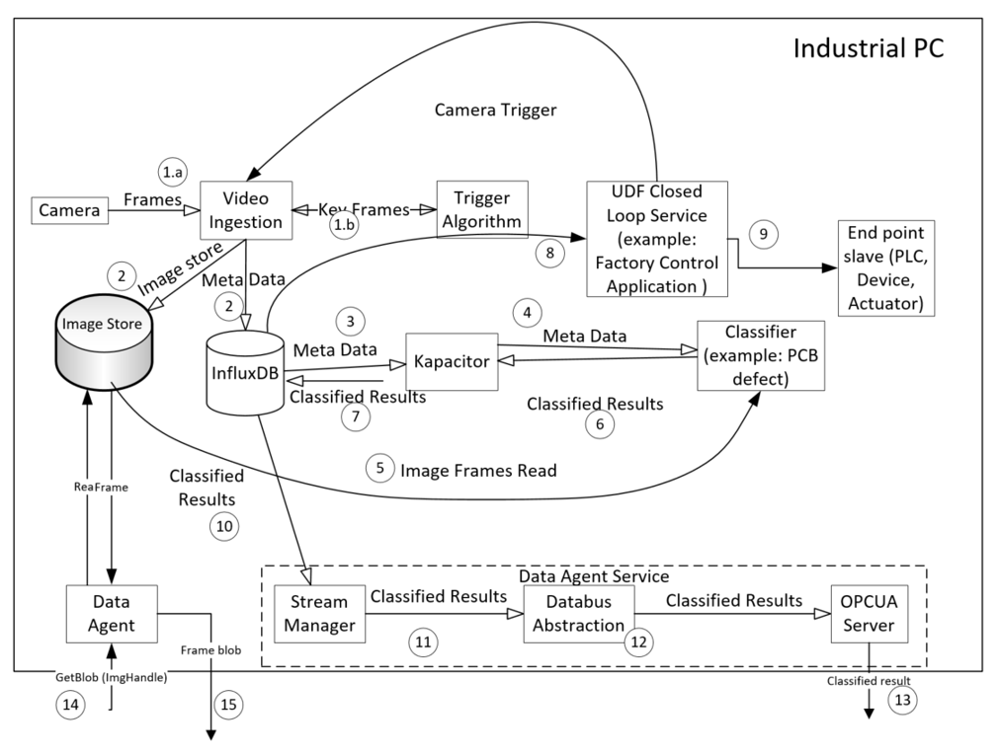
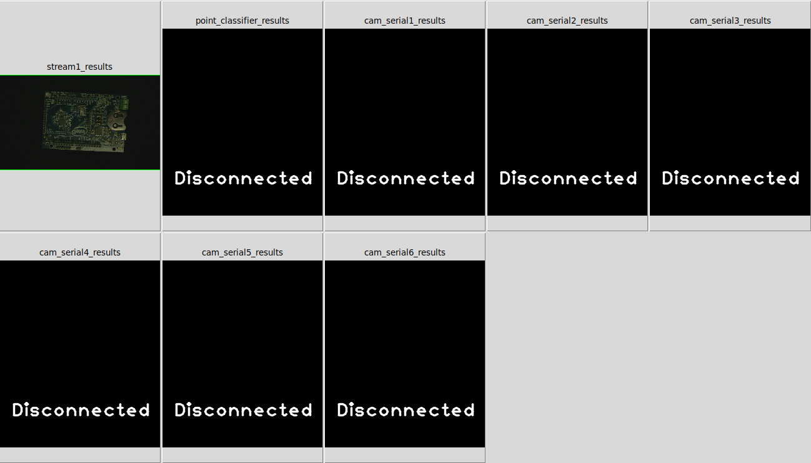

## Explore Intel® Edge Insights Software
### What is Intel® Edge Insights Software
Industrial Edge Insights Software (EIS) from Intel is a scalable solution for the industrial sector addressing various manufacturing usages which include data collection, storage and analytics on a variety of hardware nodes that span across the factory floor.
### How Industrial Edge Insights Software Works
To understand how it works, let's first understand key components of this software.

**Configuration File (factory_pcbdemo.json)**   
This file is the main configuration file for the entire work stream. It uses a standard JSON format. Using this file, a user can define the data ingestion, storage, triggers, and classifiers.

*Location:*~/IEdgeInsights/docker_setup/config/factory_pcbdemo.json

**Video Ingestion**   
The Video Ingestion module in the EIS is a user defined function, which uses the Data Ingestion library to ingest data to InfluxDB and Image store



*Location:*~/IEdgeInsights /VideoIngestion/

**Trigger**   
This filters the incoming data stream, mainly to reduce the storage and computation requirements by only passing on frames of interest. All input frames are passed to the Trigger.  When it detects a frame of interest based on user defined functions, it activates a signal which causes that frame to be saved in the Image Store database, and the metadata for that frame in the InfluxDB database.

*Location:*~/IEdgeInsights /algos/dpm/triggers/

**Classifier**   
The is a user defined algorithm that is run on each frame of interest. Kapacitor, an open source data processing engine, subscribes to the meta-data stream , and the classifier receives the meta-data from Kapacitor. The classifier pulls the frame from the Image Store, and saves the analysis results as metadata back into the InfluxDB database.

*Location:*~/IEdgeInsights /algos/dpm/classification/classifiers/

**visualizer**   
      This is to view resulting output

*Location:*~/IEdgeInsights /tools/visualizer/


***By now we understood the components, Let's understand how data flows between these components.***



**Step-1.a:**
The Video Ingestion module starts capturing frames from Basler camera /
RTSP camera (or video file) and sends the frames to the Trigger Algorithm.

**Step-1.b:**
The Trigger Algorithm will determine the relevant frames that are to go to
the Classifier. In the PCB demo use case, the Trigger Algorithm selects the images with the full PCB within view and send relavant frames to teh Video Ingestion.

**Step-2:**
The relevant frames from the Trigger Algorithm are stored into Image Store and the corresponding meta-data is stored in InfluxDB

**Step-3:**
Kapacitor subscribes to the Meta Data stream. All the streams in InfluxDB are subscribed as default by Kapacitor.

**Step-4:**
The Classifier UDF (User Defined Function) receives the Meta Data from Kapacitor. It then invokes the UDF classifier algorithm.

**Step-5:**
UDF Classifier Algorithm fetches the image frame from the Image Store and
generates the Classified Results with defect information, if any. Each frame
produces one set of Classified Results.

**Step-6:**
The Classifier UDF returns the classified results to Kapacitor.

**Step-7:**
The Kapacitor saves the Classified Results to InfluxDB. This behavior is enforced in the Kapacitor TICK script.

**Step-8:**
The Classified Results are received by Factory Control Application.

**Step-9:**
The Factory Control Application will turn on the alarm light if a defect is found in the part.

**Step-10:**
The Stream Manager subscribes to the Classified Results stream. The policy of stream export is set in the Stream Manager.

**Step-11:**
The Stream Manager uses the Data Bus Abstraction module interfaces to publish the Classified Results stream. The Data Bus Abstraction provides a publish-subscribe interface.

**Step-12:**
Data Bus Abstraction creates an OPC-UA Server, which exposes the Classified Results data as a string.

**Step-13:**
The Classified result is published in the OPC-UA message bus and available to external applications

**Step-14:**
The image handle of the actual frame is part of the Classified Results. The raw image can be retrieved through the data agent using the GetBlob() API.

**Step-15:**
The raw image frame is returned in response to the GetBlob() command.


**NOTE:** As an application developer, you do not need to worry about handling the data flow described above from data ingestion to classification. The included software stack using InfluxDB and Kapacitor handle the data movement and storage.


### Running Defect detection demo application                            
**Description**   
Printed Circuits Boards(PCBs) are being inspected for quality control to check if any defects(missing component or components are short) are there with the PCBs. To find out the defects a good quality PCB will be compared against the defective ones and pin point the location of the defect as well.

Input to the application can be from a live stream or from a video file. Here video file (~/IEdgeinsights/docker_setup/test_videos/pcb_d2000.avi) is used for this demo.

**Build and Run Sample.**  
To **build** the sample pcbdemo sample application execute the following commands.

```bash
cd ~/IEdgeinsights/tools/visualizer/
sudo make build
```

To **run** the sample application , execute the below command:

```bash
sudo make run CERT_PATH=${iei_install_dir}/cert-tool/Certificates/ HOST=localhost IMAGE_DIR=/opt/intel/iei/saved_images DISPLAY_IMG=true
```
**Pcb-Demo Output**   
Once the application successfully runs. The output window will be poped up as below.



Now we understood the Intel® Edge Insights Software framework components and run pcbdemo application successfully.    
Let's Deploy a Restricted Zone Notifier Reference implementation using Intel® Edge Insights Software framework in our next lab.

## Next Lab
[Deploying Restricted Zone Notifier using Edge Insights Software framework](./lab_restricted_zone_notifier.md)  
