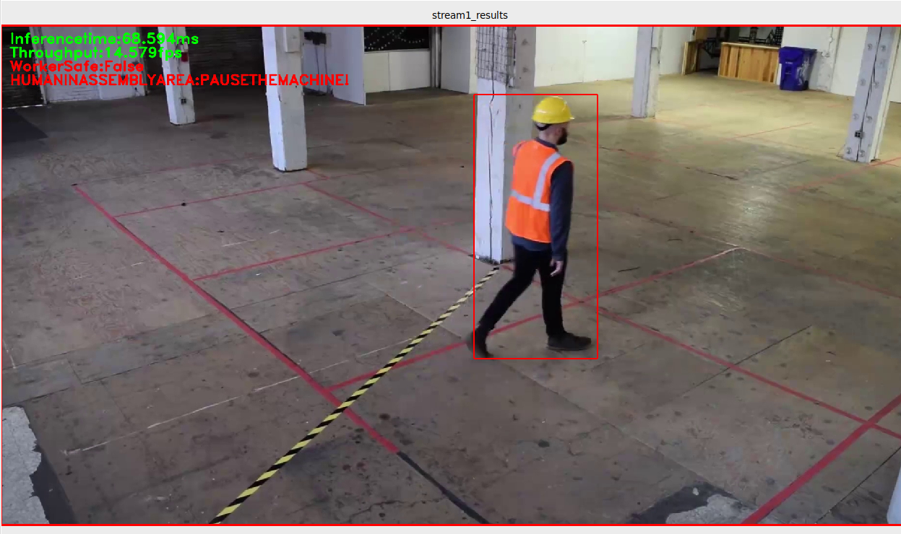

## Deploying Restricted Zone Notifier using Intel® Edge Insights Software framework
### Lab Overview
In our previous lab, we have successfully created a new application using the Intel® Edge Insights Framework. We will deploy the Restricted Zone N otifier reference implementation using Intel® Edge Insights Framework.

### Steps to Complete this lab:

- Integrate the application configuration into EIS
- Customize the visualizer application in order to view the resulting output.
- Download the model and video files.
- Setup the OPC-UA server to receive warning messages form the classifier.
- Run the application using different Intel's Accelerators(CPU/GPU/MYRIAD).


## Integrating Configuration into EIS

In the previous, lab we created a custom application configuration called **restricted_zone_notifier.json**. To use that configuration file in the EIS framework, perform the following steps: 

We will need to upDate the following files:

- $EIS_HOME/docker_setup/.env
- $EIS_HOME/VideoIngestion/VideoIngestion.py
- $EIS_HOME/DataAnalytics/PointDataAnalytics/classifer_setup.py

#### Update the environment
- To complete this, run the following commands in the terminal:

    ```bash
    cd  $EIS_HOME/docker_setup
    sudo gedit .env
    ```
- Set the **IEI_SERVICE** variable to the configuration file **services_video.json**
- Set the **CONFIG_FILE** variable to the configuration file **restricted_zone_notifier.json**
- Set that **DEV_MODE** to **false **

#### Update VideoIngestion module
- To complete this, run the following commands in the terminal

    ```bash
    cd  $EIS_HOME/VideoIngestion
    sudo gedit VideoIngestion.py
    ```
- Find and replace the name of the configuration file **factory_pcbdemo.json** with **restricted_zone_notifier.json** .


#### Update classifier setup
- To complete this, run the following commands in the terminal

    ```bash
    cd $EIS_HOME/DataAnalytics/PointDataAnalytics
    sudo gedit classifier_startup.py
    ```
- Find and replace the name of the configuration file ```factory_pcbdemo.json ``` with ```restricted_zone_notifier.json``` .


## Customize visualizer application

For visualizing the results of the video analytics, the a visualizer app is available with the IEdgeInsights software framework. This is a sample app which uses the OPC-UA client for receiving the analytics results and the GRPC client for receiving the image frames and do a simple visualization.

To customize the visualizer application(visualizer.py) modify the **config.json** file available in  **$EIS_HOME/tools/visualizer/** path.

- To complete this task run the following commands to complete this task
    ```bash
    cd $EIS_HOME/tools/visualizer
    sudo gedit config.json
    ```
and replace the contents of the config.json with the below configuration details to view the result in a single window

 ```
    {
      "output_streams": [
        "stream1_results"
      ]
    }
 ```

### Download video 
We will be using a test video from the Intel IoT DevKit repository. It shows workers entering a simulated restricted zone and will be used to test the EIS pipeline.

```bash
cd $EIS_HOME/docker_setup/test_videos
wget https://github.com/intel-iot-devkit/sample-videos/raw/master/worker-zone-detection.mp4
```

### Download Model 
The ia_data_analytics docker container which runs the classification using openVINO requires a specific person detection model to detect when workers enter the restricted zone. Usually you would use the OpenVINO model downloader to get the models but we will just pull them from the workshop Github repo.  The model files need to be copied into the docker setup path so that the ia_data_analytics container can locate it:

```bash
cd $EIS_HOME/docker_setup/config/algo_config
mkdir restricted_zone_notifier
cd restricted_zone_notifier
wget https://github.com/SSG-DRD-IOT/lab-restricted-zone-notifier-using-EIS/raw/master/Models/person-detection-retail-0013-fp16.bin
wget https://github.com/SSG-DRD-IOT/lab-restricted-zone-notifier-using-EIS/raw/master/Models/person-detection-retail-0013-fp16.xml
wget https://github.com/SSG-DRD-IOT/lab-restricted-zone-notifier-using-EIS/raw/master/Models/person-detection-retail-0013.bin
wget https://github.com/SSG-DRD-IOT/lab-restricted-zone-notifier-using-EIS/raw/master/Models/person-detection-retail-0013.xml
```

#### Generate certificates:
- Run the following commands

    ```bash
    cd $EIS_HOME/cert-tool
    python3 main.py
    ```

### Build and Run the Application
We are now ready to build and run out application with the certificates that were generated.

- Run the following commands

    ```bash
    cd $EIS_HOME/docker_setup
    sudo make provision CERT_PATH=../cert-tool/Certificates/
    sudo make install CERT_PATH=../cert-tool/Certificates/
    ```
- Next check to see if the EIS pipeline is running properly: 

    ```bash
    tail -f /opt/intel/iei/logs/consolidatedLogs/iei.log
    ```
If all the containers built and ran correctly you will see:

```
ia_data_agent         | I0927 12:43:00.189728       7 StreamManager.go:191] Publishing topic: stream1_results
ia_video_analytics    | 2019-09-27 12:43:00,374 : INFO : PEOPLE_DETECTION : [__init__.py] :classify : in line : [160] : Classify
```


#### IEI visualizer setup

- Run the following commands to run the customized restricted zone notifier apllication using EIS.

    ```bash
    sudo make distlibs
    cd $EIS_HOME/tools/visualizer
    sudo make build
    sudo make run CERT_PATH=$EIS_HOME/cert-tool/Certificates/ HOST=localhost IMAGE_DIR=/opt/intel/iei/saved_images DISPLAY_IMG=true
    ```

 On successful execution, the application sends a warning message when a person is detected in the restricted zone. The output looks like below screenshot.

 
 
 Notice also the JSON object which is written to the terminal: 
 
 ```json
 Received message: {"Measurement":"stream1_results","Channels":3.0,"Height":1080.0,"ImgHandle":"persist_bc736c96","Width":1920.0,"cam_sn":"camera-serial-number","defects":"[{\"type\":1,\"tl\":[436,237],\"br\":[686,959]}]","display_info":"[{\"info\":\"Inferencetime:42.387ms\",\"priority\":0},{\"info\":\"Throughput:23.592fps\",\"priority\":0},{\"info\":\"WorkerSafe:False\",\"priority\":2},{\"info\":\"HUMANINASSEMBLYAREA:PAUSETHEMACHINE!\",\"priority\":2}]","encoding":"jpg","idx":59979.0,"image_id":"600bef07-3915-42e3-818b-c0fe76d2c40a","machine_id":"tool_2","part_id":"e0550d60-3a4b-4f2d-82fc-98fbebdf8626","timestamp":1567196325.5299864,"influx_ts":1567196325532124746
```

Here we can see the alert status and performance of the application. 

## Optimizing Application
Now, we will explore ways of improving performance of the application.

## Visualizer 
Fetching individual frames from the image store via the Data Agent can slow down the overall performance of the application. In a industrial safty application such as the zone notifier the alert output will be used by some other system to issue an alert or pause the machinery - and so there is no need for an operator to view the video in real time. 

Let's increase the through put of our application by disabling the video frames from being fetched and displayed:

```bash
cd ~$EIS_HOME/tools/visualizer
sudo make run CERT_PATH=$EIS_HOME/cert-tool/Certificates/ HOST=localhost IMAGE_DIR=/opt/intel/iei/saved_images DISPLAY_IMG=false
```
Now there will no longer by a video output - only the JSON object in the terminal:

```json
{"Measurement":"stream1_results","Channels":3.0,"Height":1080.0,"ImgHandle":"persist_2687d37d","Width":1920.0,"cam_sn":"camera-serial-number","defects":"[]","display_info":"[{\"info\":\"Inferencetime:24.679ms\",\"priority\":0},{\"info\":\"Throughput:40.521fps\",\"priority\":0},{\"info\":\"WorkerSafe:True\",\"priority\":0}]","encoding":"jpg","idx":65649.0,"image_id":"18a6d4bd-d446-4b88-8edc-983eab4d99ef","machine_id":"tool_2","part_id":"376101d0-268d-4c30-98a4-78725fe8847d","timestamp":1567197537.8904457,"influx_ts":1567197537891778821
```

If you check the "Throughput" it should increase substantially over the pervious run. 

### Offloading Workload 

Another way to increase performance and free up CPU capacity is by running the same code on various Intel's Accelerators such as GPUs and Intel® Myriad™-VPUs.

The Restricted zone notifier application can be run on different hardwares by customizing the configuration JSON file (restricted_zone_notifier.json).

### Run application with GPU
- To Run on GPU we need to edit the restricted_zone_notifier.json file.
Execute the following commands:

    ```bash
    cd $EIS_HOME/docker_setup/config/alog_config/
    sudo gedit restricted_zone_notifier.json
    ```
- Change the device to GPU ```device=GPU``` inside JSON file

Now re run the application:

```bash
    cd $EIS_HOME/docker_setup
    sudo make provision CERT_PATH=../cert-tool/Certificates/
    sudo make install CERT_PATH=../cert-tool/Certificates/
```
- Next check to see if the EIS pipeline is running properly: 

```bash
    tail -f /opt/intel/iei/logs/consolidatedLogs/iei.log
```
Now launch the visualizer: 

```bash
cd $EIS_HOME/tools/visualizer
    sudo make build
    sudo make run CERT_PATH=~/Workshop/IEdgeInsights-v1.5LTS/cert-tool/Certificates/ HOST=localhost IMAGE_DIR=/opt/intel/iei/saved_images DISPLAY_IMG=true
```
This will lower the stress on the CPU and cepending on the CPU and GPU of your device you will see a performance increase. 

### Next, inference with Myriad™ VPU
The Myriad™ Inference Engine plugin supports VPU devices such as the Intel® Neural Compute Stick.

- To run on an Intel® Myriad VPU, change from ```"device":GPU``` to ```"device":MYRIAD```.

- VPU devices only support FP16 data type. So we need to use the FP16 variant of our pre-trained person detection model. The pre-trained models are available in the following path.
    ```
    $EIS_HOME/docker_setup/config/alog_config/restricted_zone_notifier  
    ```
- To complete this steps, replace the following lines of code:

    ```JSON
    "model_xml": "./algos/algo_config/restricted_zone_notifier/person-detection-retail-0013.xml",
    "model_bin": "./algos/algo_config/restricted_zone_notifier/person-detection-retail-0013.bin",
    "device": "GPU"
    ```
Now launch the visualizer: 

```bash
cd $EIS_HOME/tools/visualizer
    sudo make run CERT_PATH=~/Workshop/IEdgeInsights-v1.5LTS/cert-tool/Certificates/ HOST=localhost IMAGE_DIR=/opt/intel/iei/saved_images DISPLAY_IMG=true
```
Note the differences in performance.

- with below lines of codes in **restricted_zone_notifier.json** file.

    ```JSON
    "model_xml": "./algos/algo_config/restricted_zone_notifier/person-detection-retail-0013-fp16.xml",
    "model_bin": "./algos/algo_config/restricted_zone_notifier/person-detection-retail-0013-fp16.bin",
    "device": "MYRIAD"
    ```
Now re run the application:

```bash
    cd $EIS_HOME/docker_setup/
    sudo make provision CERT_PATH=../cert-tool/Certificates/
    sudo make install CERT_PATH=../cert-tool/Certificates/
```
Now launch the visualizer: 

```bash
cd $EIS_HOME/tools/visualizer
    sudo make run CERT_PATH=~/Workshop/IEdgeInsights-v1.5LTS/cert-tool/Certificates/ HOST=localhost IMAGE_DIR=/opt/intel/iei/saved_images DISPLAY_IMG=true
```
Note the differences in performance.

### Lesson Learnt

We have created a custom application that has the user deploy the Restricted Zone Notifier Reference Implementation using the Edge Insights Software framework.

[Home](./README.md)
