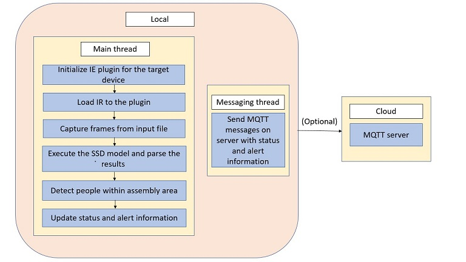
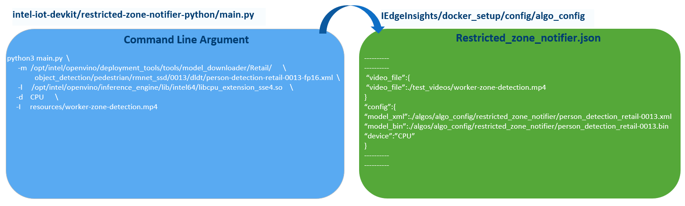
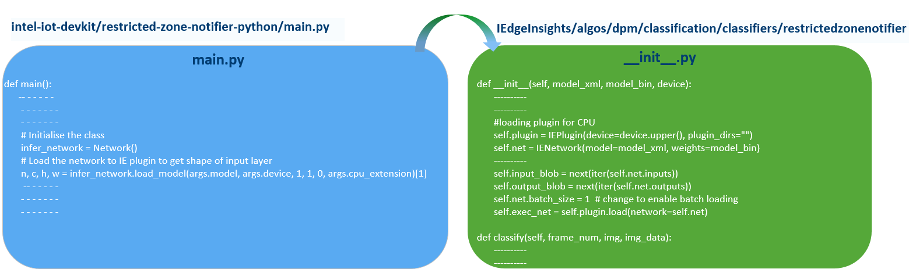
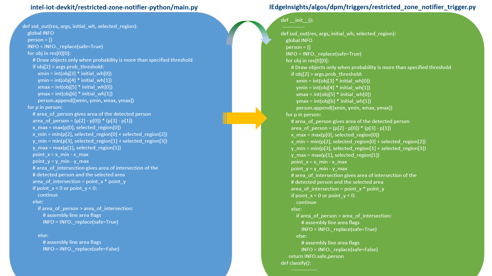
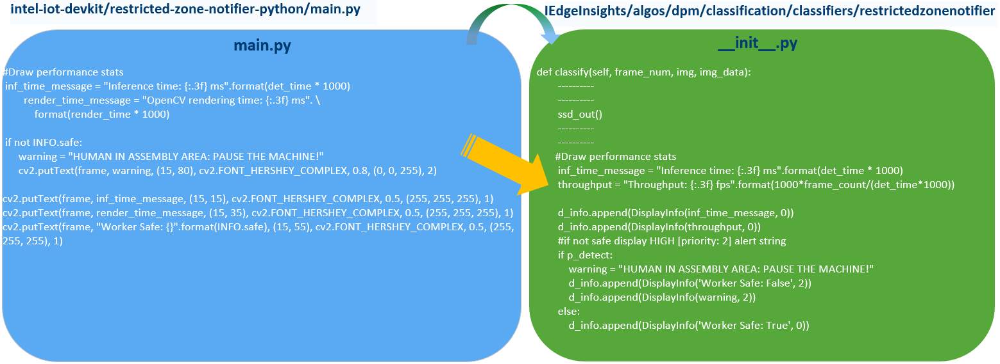

# How to Convert a python based RI to Classifier and Trigger based Intel® Edge Insights (EIS) Software

In this lab, We will understand how to port an application developed in python and run as single script to the classifier and trigger based Intel® Edge Insights (EIS) Software framework. Here, we will understand this with an example (**Restricted Zone Notifier**).

## Understanding Restricted Zone Notifier code flow
This sample is intended to demonstrate how to use Inference Engine included in the Intel® Distribution of OpVIenNO™ toolkit and the Intel® Deep Learning Deployment Toolkit to improve assembly line safety for human operators and factory workers.

First, let us have a look on the below code flow for restricted zone notifier.

**Now**, Lets understand how we can convert this python based RI to EIS framework step by step.

### 1. Provide input to run the application

In Python based RI, input is provided using command line . Whereas in EIS framework, a JSON file is provided where an user provide the inputs for inferencing. The JSON files are available in **IEdgeInsights/docker_setup/config/algo_config** directory.

### 2. Initialization and loading IR to the plugin for target device

  In EIS framework, a **Classifier** module is provided where the plugin initialization and inference can be done.

  The Classifier module has two methods: `__init__` and `classify`.

  `__init__`  : This method is used for initialization and loading IR to the plugin for target device.  
  `classify` : To do the inferencing and capturing the inference output, this method can be used.

### 3. Capture frames from input file
- In python based RI, the  frames captured from image/video using cv2.Videocapture and frames used for further processing during inferencing.

- In EIS framework, this has to be done using **Trigger** module.Trigger module in the EIS software receives the captured frames from VideoIngestion module. The purpose of trigger algorithm is to select frames of interest from the camera stream. The algorithms depends on the use case, people monitoring might need classifier algorithms to execute on all frames from the camera whereas a use case like the sample application “pcbdemo” would need the classifier to execute on only the frames where the PCB board is in the center of the frame.

- Once processed video frames as they are received and call the callback registered by the register_trigger_callback() method if the frame should trigger the execution of the classifier

The porting has to be done as below:

### 4. Execute SSD model and parse results

This part of the sub-module needs to be done just after the inferencing results. So it can be included in the classifier `__init__.py` is available in IEdgeInsights/algos/dpm/classification

The porting has to be done as below:

### 5. Update Status and Alert information
- The status and alert information is also included in classifier `__init__.py` is available in IEdgeInsights/algos/dpm/classification/classifiers directory.
classify() returns display and defect information.

### 6. Messaging Thread
In Python based RI Worker thread (Messaging Thread) that publishes MQTT messages to Server to display the output.

In EIS framework, a OPC/UA based visualizer application is available. We will use that to view the resulting output.
The warning message from the classifier will be displayed using visualizer application along with inference time details. So the display and defect information will be send to OPC/UA server from classifier.

Now we understood, how a python based RI can be converted to Classifier and Trigger based Intel® Edge Insights (EIS) Software. So, let's implement in our next lab.

## Next Lab
[Deploying Restricted Zone Notifier using Edge Insights Software framework](./lab_restricted_zone_notifier.md)
