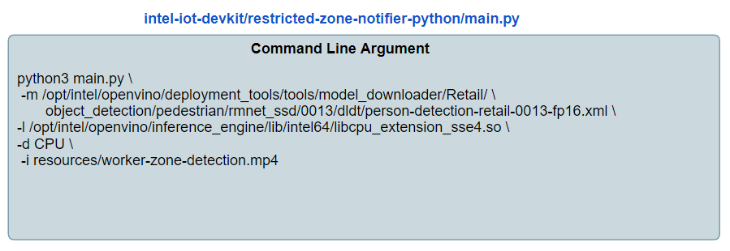
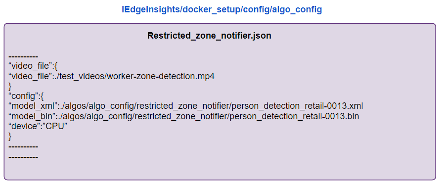
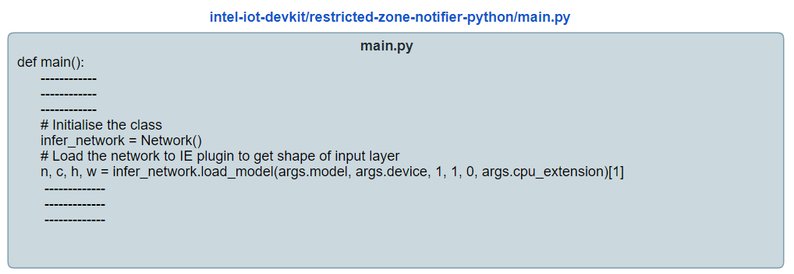
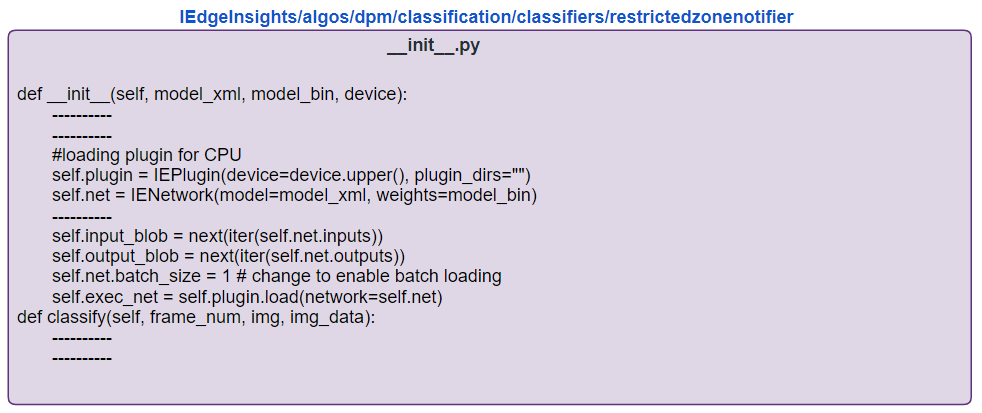
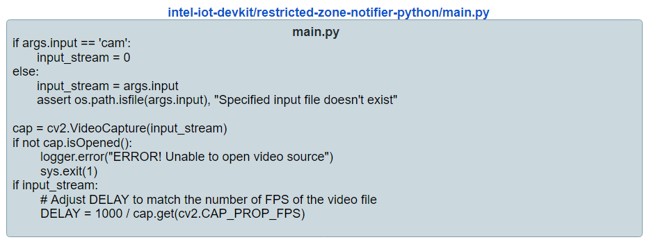
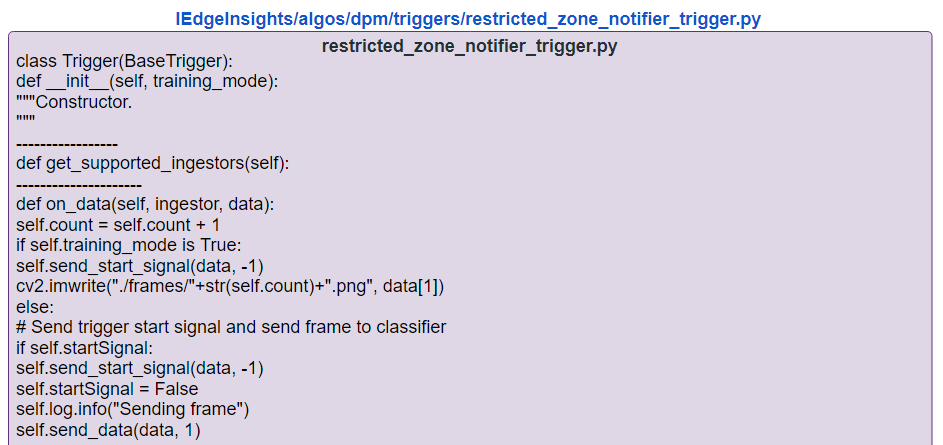
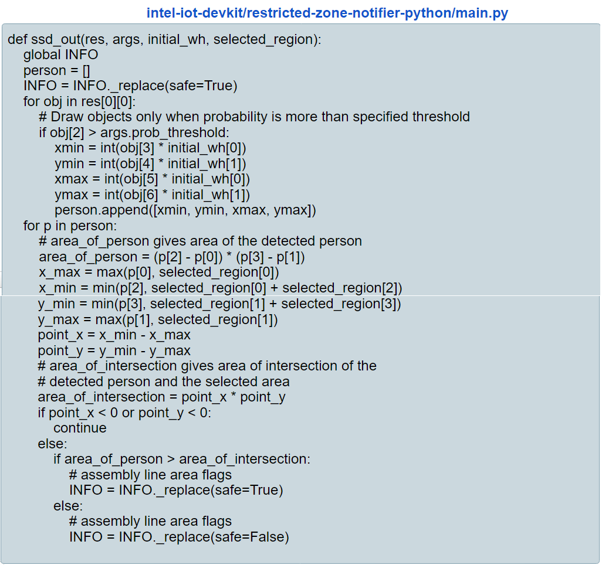
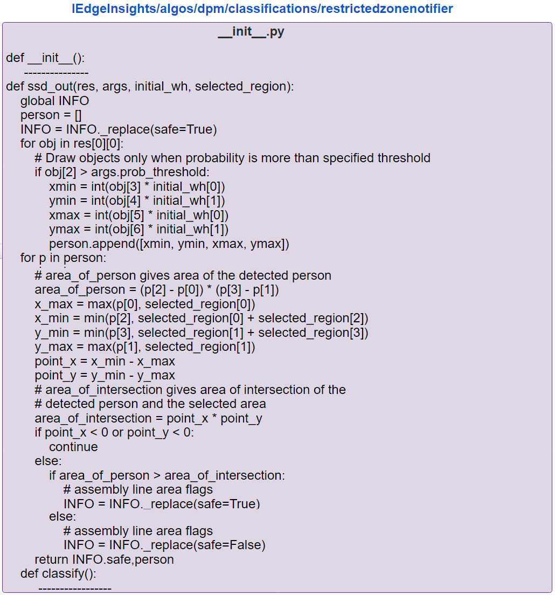
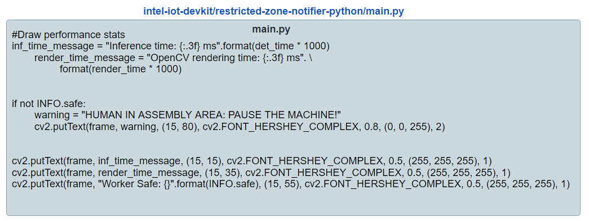
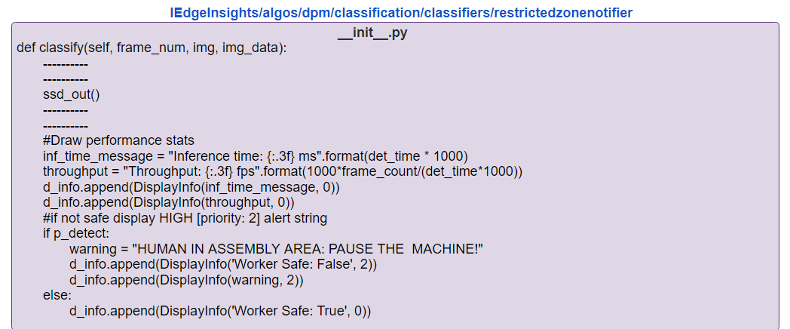

# Implementing an Classifier and Preprocessing Trigger based Intel® Edge Insights (EIS) Software

This lab shows the steps that an application developer will need to implement to create a video analytics solution on the Edge Insights Software framework.

## Reference Implementations on the Intel Development Zone

The Intel Developer Zones has many reference implementation applications, sample code snippets and whitepapers to help you start building with Intel technology.

On the [Industrial Reference Implementations and Code Samples](https://software.intel.com/en-us/industrial) page, you can browser difference ready-made applications. We will be porting the [Restricted Zone Notifier](https://software.intel.com/en-us/iot/reference-implementations/restricted-zone-notifier) to the Edge Insights Software framework.

The source code for the Restricted Zone Notifier can be found on Github.
https://github.com/intel-iot-devkit/restricted-zone-notifier-python.

## Description of the Restricted Zone Notifier that will be Ported to EIS

First let's look at the reference implementation of the Restricted Zone Notifier. This is an OpenVino application which determines whether a worker is in an unsafe or restricted zone. The classification results are sent to an MQTT broker and published for third-party applications.

## Steps to Port Application to EIS

1. Create the Restricted Zone Notifier Application Configuration JSON file
2. What is a directory called restricted Zone Notifier in the classifier directory
3. Create a Python file for the user defined classifier algorithm
4. Deploy application

###

First, let us have a look on the below code flow for the restricted zone notifier application.


**Now**, Lets understand how we can convert this python based RI to EIS framework step by step.

### Setup Environmental Variables

For our convenience, let's set an environmental variable called **EIS_HOME** to refer to the root level directory of the Edge Insights Software.

**During the workshop be sure to check this location or ask your instructor. **

```bash
export EIS_HOME=/home/eis/IEdgeInsights-lab-restricted-zone-notifier
```

### Create Directories for the New EIS Application

First, let's create the directory for the new user-defined classification function and create an empty ****init**.py** file to contain our implementation.

```bash
mkdir $EIS_HOME/algos/dpm/classification/classifiers/restrictedzonenotifier
touch $EIS_HOME/algos/dpm/classification/classifiers/restrictedzonenotifier/__init__.py
```

### Create the Application Configuration JSON file

In the **$EIS_HOME/docker_setup/config/algo_config** create a file named **restricted_zone_notifier.json**. This file will contain a JSON object that defines the video sources, preprocessing trigger location and the classifier function location.


When launching the reference implementation normally parameters such as the model to use, any library plugins, the hardware to run inference on, and the location of the input file are set on the command line:



We will set these configuration parameters in the restricted_zone_notifier.json application configuration file in the **video_file**, **model_xml**, **model_bin**, and **device** fields. 

We will also set the trigger alogorithm and the classification alogrithm to be used in the solution in this configuration file. 

The reference implementation does not have any data pre-processing so we will use the **bypass_trigger** which sends all incoming frames to the classification engine. 

For the classification module we will point to the currently empty **restrictedzonenotifier** folder that we created earlier. 


Create the .json file:

```bash
gedit $EIS_HOME/docker_setup/config/algo_config/restricted_zone_notifier.json
```

Next copy and paste this text into the newly created file:

```JSON
{
    "machine_id": "tool_2",
    "trigger_threads": 1,
    "queue_size" : 10,
    "data_ingestion_manager": {
        "ingestors": {
            "video_file": {
                "video_file": "./test_videos/worker-zone-detection.mp4",
                "encoding": {
                    "type": "jpg",
                    "level": 100
                },
                "img_store_type": "inmemory_persistent",
                "loop_video": true,
                "poll_interval": 0.2
            }
        }
    },
    "triggers": {
        "restricted_zone_notifier_trigger": {
            "training_mode": false
        }
    },
    "classification": {
        "max_workers": 1,
        "classifiers": {
            "restrictedzonenotifier": {
                "trigger": [
                    "restricted_zone_notifier_trigger"
                ],
                "config": {
                    "model_xml": "./algos/algo_config/restricted_zone_notifier/person-detection-retail-0013.xml",
                    "model_bin": "./algos/algo_config/restricted_zone_notifier/person-detection-retail-0013.bin",
                    "device": "CPU"
                }
            }
        }
    }
}
```

### Download Required Video files and Inference Models

Notice that the **data_ingestion_manager** has one ingestor defined and it is a video file located at **"./test_videos/worker-zone-detection.mp4"**

You will need to download this file and place it in the following directory:
```
cd $EIS_HOME/docker_setup/test_videos
wget https://raw.githubusercontent.com/SSG-DRD-IOT/lab-restricted-zone-notifier-using-EIS/master/videos/worker-zone-detection.mp4
```

You will also need to download the OpenVINO inference models and label files **person-detection-retail-0013.xml** and **person-detection-retail-0013.bin**

```bash
mkdir $EIS_HOME/docker_setup/config/algo_config/restricted_zone_notifier
cd    $EIS_HOME/docker_setup/config/algo_config/restricted_zone_notifier

wget https://github.com/SSG-DRD-IOT/lab-restricted-zone-notifier-using-EIS/blob/master/Models/person-detection-retail-0013.bin
wget https://raw.githubusercontent.com/SSG-DRD-IOT/lab-restricted-zone-notifier-using-EIS/master/Models/person-detection-retail-0013.xml

```


### 1. Provide input to run the application

In Python based reference implementation the model to use in classification, plugin libraries, the hardware to run the code on, and the source video are set on the command line at launch. In the EIS framework, a JSON file is created that has all of these parameters set. The JSON file is available in the **IEdgeInsights/docker_setup/config/algo_config** directory.




### 2. Initialization and loading IR to the plugin for target device

In the EIS framework, a **Classifier** module is provided where the plugin initialization and inference can be done.

The Classifier module has two methods: `__init__` and `classify`.

`__init__` : This method is used for initialization and loading the intermediate representation model to the plugin for the target device.  
 `classify` : This method is used for inferencing and capturing the inference output.

To create the **init**.py module the initialization parameters from the main() function of our pytthon script are ported over.





### 3. Capture frames from input file

- In the python based code, the frames are captured from image/video using cv2.Videocapture.

* In EIS framework, the fframe capture is done using the **Trigger** module.The trigger module in the EIS stack receives the captured frames from the VideoIngestion module. The purpose of the trigger algorithm is to select frames of interest from the camera stream and pass them to the VideoAnalytics module. The algorithm to use in the trigger modul depends on the use case. For people monitoring you might need a classifier algorithm to execute on all frames whereas a use case like the sample application “pcbdemo” would need the classifier to execute on only the frames where the PCB board is in the center of the frame.

* After the video frames are processed by the trigger they are registered by the register_trigger_callback() method to be passed to the classifier.

The section of code in main.py that deals with the video frame input is ported to the resttricted zone notifier trigger script.





### 4. Run Classification and parse results

After the trigger selects a frame it is sent to the classifier to run through the model and generate the results needed.
To set up the classifier we use the code from main.py which defines the Single Shot Detector (SSD) model and port it over to `~/Workshop/IEdgeInsights-v1.5LTS/algos/dpm/classification/classifiers/restrictedzonenotifier/__init__.py`





### 5. Update Status and Alert information

- The status and alert information is also included in the same classifier `__init__.py`. This classify method returns defect information as well as statistics about the inference time and throughput of the data pipeline.





### 6. Messaging Thread

The Python based reference implementation messaging thread publishes MQTT messages to Server to display the output.

In the EIS framework the messages are published over OPC/UA by the Data Agent Service. We will use an OPC/UA client to view those messages. This OPC/UA client is located in ~/Workshop/IEdgeInsights-v1.5LTS/tools/visualizer and does not need to be customized for this application.

You should now have a better idea of how an existing code base can be converted to Classifier and Trigger based Intel® Edge Insights (EIS) Software. In the next lab we will implement all of these modules and run the restricted zone notifier using EIS.

## Next Lab

[Deploying Restricted Zone Notifier using Edge Insights Software framework](./lab_restricted_zone_notifier.md)
